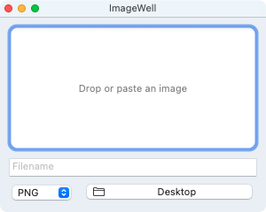

# AllsWell

A convert-everything Mac utility, grown from
[ImageWell](https://github.com/kimslawson/imagewell): a single media well.
Drop or paste a file into it and it is immediately converted and saved to the
folder of your choice.

|  |  |
|:---:|:---:|
| Drag a file to the app icon in the Dock | or to the well |

Today the well converts images (PNG, JPG). Audio and video are next: the
conversion engine is a small `Converter` protocol, and each media class is a
backend behind it.

## Behavior

- **Drop or paste.** Drag a file (or raw image data) into the well, or focus
  the well and ⌘V. Dropping a file on the Dock icon works too, even when the
  window is closed.
- **Auto-save.** The moment something lands, it is converted and written to
  the current destination using the current filename and format. A small toast
  confirms where it went. Conversions that take more than a beat show a thin
  progress bar with a cancel ✕ over the well.
- **Type-aware format picker.** The format popup offers what makes sense for
  what you dropped, and remembers your last choice per media class.
- **Fix-ups are renames.** Editing the filename, switching the format, or
  changing the destination after a save re-converts and moves the previous
  auto-saved file to the Trash — no littered copies.
- **Filename prefill.** Dragged files keep their original name; pasted data
  gets a timestamp (`Media 2026-06-11 at 14.32.05`). Name collisions get
  ` 2`, ` 3`, … appended.
- **HEIC gets converted.** Incoming HEIC/HEIF automatically flips the format
  picker to JPG. Anything ImageIO can read natively (TIFF, GIF, BMP, WebP,
  …) is ingested and converted; EXIF rotation is baked in so exports are
  upright. JPG exports use 0.9 quality and flatten transparency onto white.
- **Destination memory.** Defaults to the Desktop; remembers the last folder
  you picked (and the last format per media class) across launches.

The window is a utility panel — narrow titlebar, small traffic lights, small
title. The filename, format, and destination controls live in a compact strip
under the well.

No dependencies. AppKit + ImageIO only.

## Building

Requires macOS 13+ and Xcode 15+.

Open `AllsWell.xcodeproj` in Xcode and run, or from the command line:

```sh
xcodebuild -project AllsWell.xcodeproj -target AllsWell -configuration Release build
open build/Release/AllsWell.app
```

The app is ad-hoc signed and unsandboxed; macOS will ask once for permission
to write to Desktop/Documents/Downloads.

## App icon

The icon (an old-school Aqua image well holding a generic image file, drawn
on the modern macOS icon grid) is generated by:

```sh
pip3 install pillow
python3 scripts/make_icon.py
```

which rewrites the PNGs in `AllsWell/Assets.xcassets/AppIcon.appiconset/`.
