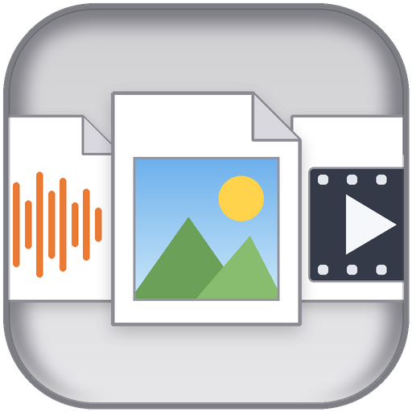
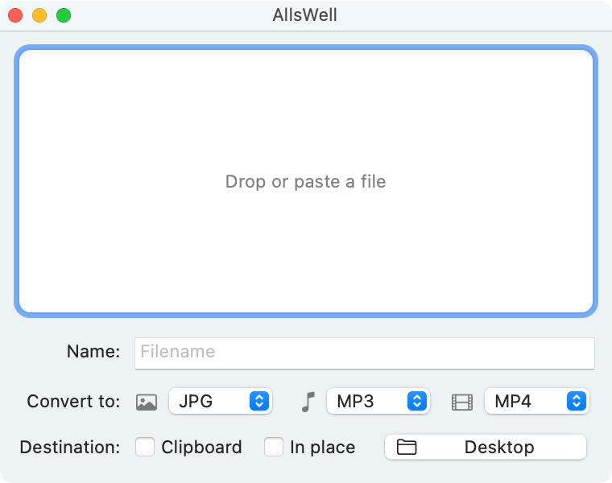

# AllsWell

A tiny native Mac media converter built around a single media well.

Drop or paste media. Pick the format. AllsWell converts it immediately.

|  |  |
|:---:|:---:|
| Drop on the Dock icon | or into the well |

## Formats

| | In | Out | + with ffmpeg |
|---|---|---|---|
| Images | Anything ImageIO reads (HEIC, TIFF, GIF, WebP, …) | PNG, JPG | — |
| Audio | MP3, WAV, AIFF, CAF, FLAC, M4A | M4A (AAC), WAV, FLAC, ALAC | MP3, OGG |
| Video | Anything AVFoundation reads | MP4 (H.264), HEVC, ProRes, M4A (audio) | WebM, MP3 (audio); MKV, AVI, … in |

Native conversion is ImageIO and AVFoundation only. ffmpeg is optional and
never bundled: if Homebrew or MacPorts has one installed, the formats its
build can encode appear in the pickers.

## Use

- **Drop, paste, or Dock.** Drag into the well, ⌘V, or drop on the Dock icon,
  even with the window closed.
- **Batches.** Drop many files or a folder (top level only). Pickers show only
  the media types present, files already in the target format are skipped,
  and errors go to the log instead of dialogs.
- **Fix-ups replace.** Change the name, format, or destination after a save and
  it re-converts, trashing the previous output.
- **Get it out.** Drag from the well into any app, ⌘C, or click the copy button
  that appears on hover.
- **Destination.** A folder (Desktop by default), In place next to the
  originals, and/or Clipboard. Remembered across launches, along with your
  last format per media type.
- **Sensible defaults.** HEIC defaults to JPG and odd video containers to MP4.
  Images export upright; JPGs at 0.9 quality, transparency on white. Pasted
  media is named `Media 2026-06-11 at 14.32.05`; collisions get ` 2`, ` 3`.
- **Log.** Window ▸ Show Log (⌘L) lists every save, skip, and failure, with
  reasons.
- **Brushed Metal.** View ▸ Brushed Metal, for old times' sake.

## Building

macOS 13+, Xcode 15+. Open `AllsWell.xcodeproj` and run, or:

```sh
xcodebuild -project AllsWell.xcodeproj -target AllsWell -configuration Release build
open build/Release/AllsWell.app
```

The app is ad-hoc signed and unsandboxed; macOS asks once before it writes to
Desktop, Documents, or Downloads.

## App icon

Generated by `scripts/make_icon.py`, which rewrites
`AllsWell/Assets.xcassets/AppIcon.appiconset/`:

```sh
pip3 install pillow
python3 scripts/make_icon.py
```
